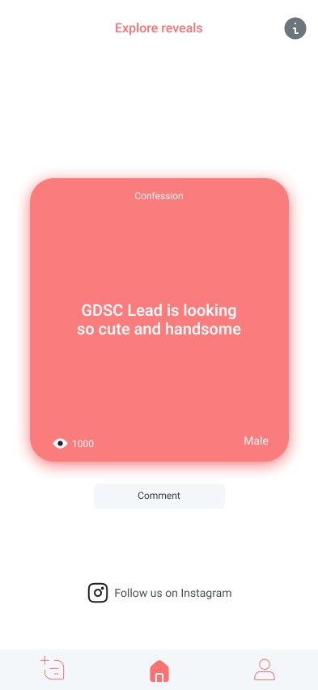
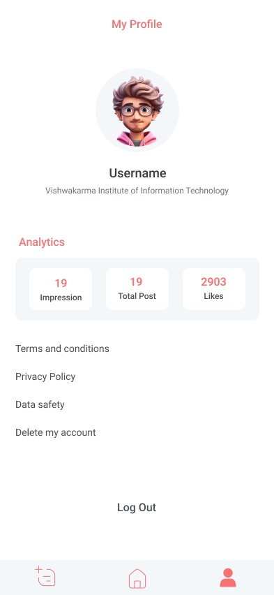

<h2>Contact Details</h2>

 

 

<h2><b>This was the problem statement that I got in the interview of the SkillCrunch pvt. ltd. as a flutter developer.</b></h2>

<h3><b>I created the solution with some more functionalites than I got in problem statement and design for example -</b></h3>

1. Created the Chat screen  
2. Added the dialog boxes for user interaction  
3. UI changes  
4. And more  

 

<a href="app-release.apk"><h3>Download APK</h3></a>

 

<h4><b>I got the problem in the form of screen design as below -</b></h4>

 

 

<h4><b>And the below is my submission of the solution I created -</b></h4>

 

